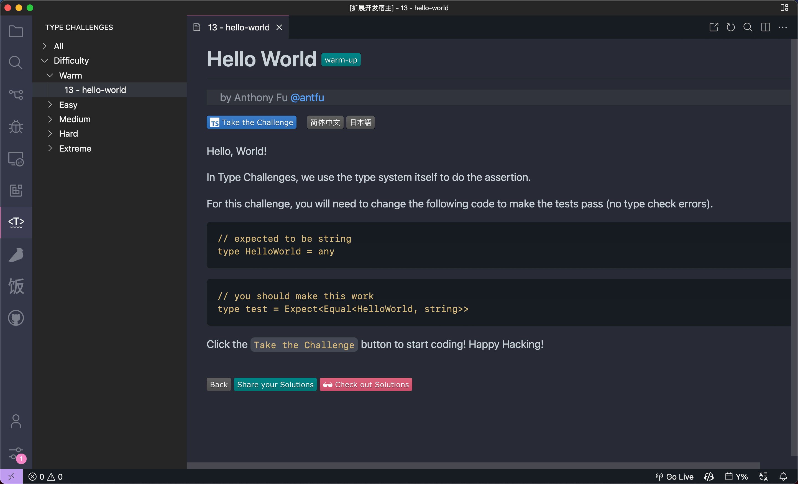

 

Take Type Challenges in VS Code

 

**Status**: Preview

## Features

- View challenges in the side panel
- View challenges by difficulty/tag/author
- Take the challenge directly in VS Code
- Show the status of each challenge
- Dark/Light mode

## Related

- [Type Challenges](https://github.com/type-challenges/type-challenges) - Collection of TypeScript type challenges with online judge

## License

MIT License © 2022 [YRM](https://github.com/yrming)
